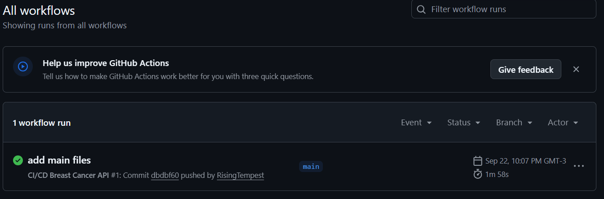

# Proyecto: Contenerización de una API ML con Docker

## Descripción
Desarrollar un sistema completo que integre un modelo de Machine Learning (clasificación o regresión), exponerlo como API REST mediante Flask, contenedorizado con Docker, y desplegado profesionalmente en una plataforma en la nube (AWS SageMaker, Google Vertex AI o Azure ML). Se espera automatizar al menos parte del flujo de trabajo usando buenas prácticas de CI/CD y demostrar la capacidad de monitoreo, versionado y actualización.

---

## Requisitos

```bash
Python ≥ 3.10.0  
```

**Librerías necesarias:**

```bash
flask==3.1.2
scikit-learn==1.7.0
numpy==1.26.2
joblib==1.3.2
requests==2.31.0
mlflow==3.4.0
```

**Entorno Docker:**

Para correr la API dentro de un contenedor:

- Tener Docker Desktop instalado (Windows, macOS o Linux)
  - En Windows, se recomienda versión AMD64 o ARM64 según tu procesador
- Habilitar WSL2 en Windows y descargar una distribución Linux (Ubuntu)
- Verificar que Docker se ejecuta correctamente (`docker version`)
- El puerto 5000 debe estar libre en tu máquina, ya que es el que se mapea para exponer la API.

**Tener una cuenta en alguna nube, en este caso particular será en AWS (Amazon Web Services)**

## Estructura de Archivos

```bash
/Actividad1_GonzaloMoyano
├─ app.py                   # Código de la API REST
├─ modelo.pkl               # Modelo entrenado
├─ README.md                # Este archivo
├─ test_api.py              # Script para probar la API con ejemplos
└─ train_model.py           # Script para entrenar y guardar el modelo
└─ Dockerfile               # Instrucciones para construir la imagen Docker
```

---

## Archivos principales

Para poder ejecutar la tarea de forma completa, lo primero es tener los siguientes archivos funcionales:

- requirements.txt: librerías necesarias para ejecutar el proceso, también necesario en este formato para ser copiado en Dockerfile.
- data.csv: dataset breast cáncer de kaggle (necesita preprocesamiento)
- train_model.py: limpia el dataset **data.csv** y lo entrena usando RandomForestClassifier, aplicando RandomSearchCV para una búsqueda simple de mejores hiperparámetros. Genera un **modelo.pkl**.
- app.py: crea la app con Flask para la predicción de breast cáncer utilizando el modelo generado con **train_model.py**.
- Dockerfile: creación de la imagen docker en base a los requirements, modelo y app creados anteriormente.
- ci.yml: script en YAML que le dice a GitHub qué hacer automáticamente cada vez que haces un push a tu repositorio.

> El archivo ci.yml debe estar dentro de la carpeta .github/workflows para que funcione correctamente.


## Antes de subir los archivos a Github

Antes de hacer un push a Github, es recomentable probar que el proceso desde el entrenamiento del modelo hasta la generación de la imagen de docker de forma local, así nos aseguramos de que todo funcione correctamente una vez se hace el push y se inicia el workflow. La forma de probar que ftodo funcione se detalla a continuacion:

### 1. Entrenar y guardar el modelo

```bash
python train_model.py
```

- Esto genera el archivo modelo.pkl.

---


---

### 2. Construir imagen

```bash
docker build -t cancer-api .
```

- Esto genera la imagen cancer-api en base al Dockerfile que hayamos definido.

---


---

### 3. Levantar la API

```bash
docker run -p 5000:5000 cancer-api
```

- Crea y ejecuta un contenedor a partir de la imagen **cancer-api**
- La API correrá en: `http://127.0.0.1:5000/`  

---


---


### 4. Probar la API

```bash
curl.exe http://127.0.0.1:5000/
```
- Muestra un mensaje indicando que la API esta lista

---


---

```bash
python test_api.py
```

- Muestra la predicción para 3 ejemplos:

---


---

## Notas / Advertencias

- La API debe estar corriendo (ya sea con python app.py o dentro del contenedor con docker run …) para que test_api.py funcione.  
- Revisar que el array enviado tenga exactamente **30 características**, como espera el modelo.

---
---


## Generacion del workflow en Github Actions y creación de imagen en Docker Hub

### 1. Creación del repositorio en Github
Una vez que comprobamos que todo funciona correctamente, el siguiente paso es crear un repositorio de Github para hacer push a los archivos que mencionamos anteriormente, deberia quedarnos como en la siguiente imagen:


### 2. Conexión entre Github y Docker Hub
Para conectar Docker Hub con Github, lo primero sera crear un nuevo token en Docker Hub, y como recomendación lo nombraremos Github Actions, deberia quedar algo como en la foto:


Ahora vamos al repositorio donde tenemos los archivos, vamos a **Settings** > **Secrets and variables** > **Actions**. Aquí crearemos 2 **New repository secret**, uno llamado DOCKER_USERNAME donde pondremos como secret nuestro usuario de Docker Hub y otro llamado DOCKER_PASSWORD donde colocaremos el token que generamos anteriormente en Docker Hub. 


### 3. Workflow en Github
Si todo lo anterior salio bien, podremos ejecutar el workflow haciendo **push** al repositorio, o bien de forma manual llendo a nuestro repositorio, y en **Actions** deberíamos poder observar que tenemos 1 workflow run:



Aquí podremos ejecutarlo apretando **Re-run all jobs** y si no hay ningun problema de autenticación con Docker Hub, el proceso deiese terminar correctamente, mostrando lo siguiente:


### 4. Verificación de la creación de la imagen en Docker Hube
Lo anterior muestra el proceso completo del workflow, que incluye: loggearse a Docker Hub (si no se crearon bien los secrets arrojara error), crear la imagen de docker, correr la API, testear la API con los datos proporcionados por test_api.py, y finalmente hacer un push de la imagen hacia Docker Hub, en donde podremos comprobar si la imagen fue creada:


---
---

## Despliegue en la nube

## Autores

- Gonzalo Moyano Henríquez