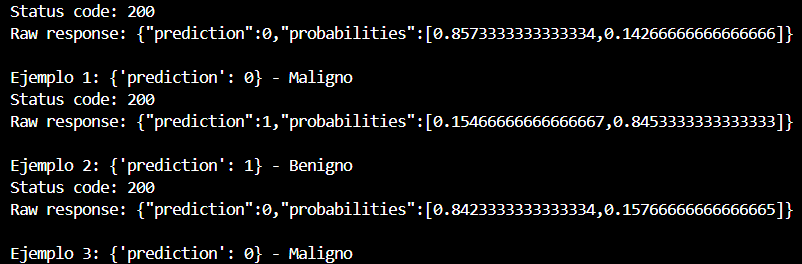

# Proyecto: MLOps en la Nube: Despliegue automatizado de un modelo predictivo real

## Descripción
Este proyecto desarrolla un sistema completo que integra un modelo de Machine Learning (clasificación o regresión) y lo expone como una API REST mediante Flask. La API se contenediza usando Docker y se despliega en una plataforma en la nube (Azure ML).  

El objetivo es automatizar parte del flujo de trabajo siguiendo buenas prácticas de CI/CD, y demostrar capacidades de monitoreo, versionado y actualización del modelo.

---

## Requisitos

```bash
Python ≥ 3.10.0  
```

**Librerías necesarias:**

```bash
flask==3.1.2
scikit-learn==1.7.0
numpy==1.26.2
joblib==1.3.2
requests==2.31.0
mlflow==3.4.0
```

## Entorno Docker

Para ejecutar la API dentro de un contenedor, se requieren los siguientes pasos:

- **Instalar Docker Desktop** en Windows, macOS o Linux.  
  - En Windows, se recomienda elegir la versión correspondiente a tu procesador: AMD64 o ARM64.  
- **Habilitar WSL2** en Windows y descargar una distribución Linux (por ejemplo, Ubuntu).  
- **Verificar que Docker funcione correctamente** ejecutando:  
  ```bash
  docker version
  ```
- Asegurarse de que el puerto 5001 esté libre, ya que será el puerto mapeado para exponer la API y es el requerido para el despliegue en Azure.

## Estructura de Archivos

```bash
/cancer_breast_api
├─ .github/                         
│  └─ workflows/                    # Workflows de GitHub Actions
│     └─ ci.yml                     # Configuración de CI/CD
├─ cloud_deploy/                    # Archivos para despliegue en la nube
│  ├─ deployment.yaml               # Despliegue en Azure ML del endpoint breastcancer-endpoint con tu imagen Docker y 1 instancia Standard_DS2_v2.
│  ├─ test_deploy.py                # Script que prueba el modelo a través del endpoint para comprobar las predicciones
├─ imagenes_readme/                 # Imágenes usadas en el README
├─ mlruns/                          # Información y métricas de las ejecuciones con MLflow
├─ app.py                           # Código de la API REST
├─ modelo.pkl                       # Modelo entrenado
├─ README.md                        # Documentación principal
├─ test_api.py                      # Script para probar la API
├─ train_model.py                   # Script para entrenar y guardar el modelo
├─ Dockerfile                       # Instrucciones para construir la imagen Docker
└─ LICENSE                          # Licencia MIT
```

---


## Archivos principales

Estos archivos son los mínimos necesarios para ejecutar y desplegar el proyecto:

- requirements.txt: Librerías necesarias para la ejecución; también se copia dentro del Dockerfile.
- data.csv: Dataset de cáncer de mama de Kaggle (requiere preprocesamiento).
- train_model.py: Limpia data.csv, entrena un modelo RandomForestClassifier con RandomSearchCV y guarda el modelo entrenado en modelo.pkl.
- app.py: API en Flask que expone predicciones usando el modelo generado.
- Dockerfile: Define la construcción de la imagen Docker basada en los requirements, el modelo y la API.
- .github/workflows/ci.yml: Workflow de GitHub Actions que automatiza tests y despliegues al hacer push.

> El archivo ci.yml debe estar dentro de la carpeta .github/workflows para que funcione correctamente.


## Antes de subir los archivos a Github

Antes de hacer un push a GitHub, se recomienda probar localmente todo el flujo: desde el entrenamiento del modelo hasta la creación de la imagen Docker. Esto asegura que el workflow se ejecute correctamente al subir los archivos.. La forma de probar que todo funcione se detalla a continuacion:

### 1. Entrenar y guardar el modelo

> Nota: las capturas fueron obtenidas en una ejecución local usando el puerto 5000, pero para los propositos finales de despliegue del modelo se requiere usar el puerto 5001 debido a Azure.

```bash
python train_model.py
```

- Esto genera el archivo modelo.pkl.

---


---

### 2. Construir imagen

```bash
docker build -t cancer-api .
```

- Esto genera la imagen cancer-api en base al Dockerfile que hayamos definido.

---


---

### 3. Levantar la API

```bash
docker run -p 5001:5001 cancer-api
```

- Crea y ejecuta un contenedor a partir de la imagen **cancer-api**
- La API correrá en: `http://127.0.0.1:5001/`  

---


---


### 4. Probar la API

```bash
curl.exe http://127.0.0.1:5001/
```
- Muestra un mensaje indicando que la API esta lista

---


---

```bash
python test_api.py
```

- Muestra la predicción para 3 ejemplos:

---


---

## Notas / Advertencias

- La API debe estar corriendo (ya sea ejecutando `python app.py` o dentro del contenedor con `docker run …`) para que `test_api.py` funcione correctamente.  
- Para ejecutar `test_api.py`, se debe abrir otra consola mientras la API sigue ejecutándose en la primera.  
- Asegúrate de que el array enviado tenga exactamente **30 características**, como espera el modelo.

---
---

## Generación del GitHub Actions workflow y creación de la imagen en Docker Hub

### 1. Creación del repositorio en GitHub
Una vez que comprobamos que todo funciona correctamente, el siguiente paso es crear un repositorio en GitHub para subir los archivos del proyecto.  
Debería verse similar a la siguiente imagen:


---

### 2. Conexión entre GitHub y Docker Hub
Para conectar Docker Hub con GitHub, primero se debe crear un **nuevo token** en Docker Hub.  
Como recomendación, podemos nombrarlo `GitHub Actions`. Debería verse así:


Luego, en el repositorio de GitHub, vamos a **Settings** > **Secrets and variables** > **Actions** y creamos **2 nuevos secrets**:  

- `DOCKER_USERNAME` → nuestro usuario de Docker Hub  
- `DOCKER_PASSWORD` → el token que generamos anteriormente  

---

### 3. Inicializar el repositorio local y hacer push a GitHub

Una vez creado el repositorio en GitHub, debemos subir nuestros archivos locales, esto se hace a través de la consola.
Los pasos básicos son los siguientes:

```bash
# Inicializar un repositorio Git local
git init

# Agregar todos los archivos al staging
git add .

# Hacer un commit inicial
git commit -m "Commit inicial del proyecto"

# Agregar el repositorio remoto (reemplaza la URL por la de tu repositorio)
git remote add origin https://github.com/usuario/nombre-repo.git

# Subir los archivos a la rama main
git push -u origin main
```

> Nota: Asegúrate de que tu rama principal se llame main. Si tu repositorio usa master, ajusta el comando git push en consecuencia.

Una vez hecho esto, GitHub detectará los archivos y podrás ejecutar el workflow de GitHub Actions automáticamente.

---

### 4. Workflow en GitHub
Si todo lo anterior se configuró correctamente, podemos ejecutar el workflow haciendo **push** al repositorio.  
También es posible ejecutarlo manualmente desde la pestaña **Actions** del repositorio, donde deberíamos ver al menos un workflow run:


Podemos hacer clic en **Re-run all jobs** para volver a ejecutar el workflow.  
Si la autenticación con Docker Hub es correcta, el proceso debería completarse exitosamente:


---

### 5. Verificación de la creación de la imagen en Docker Hub
El workflow realiza los siguientes pasos automáticamente:  

1. Loguearse en Docker Hub (si los secrets no están configurados correctamente, fallará).  
2. Crear la imagen Docker del proyecto.  
3. Ejecutar la API y testearla con `test_api.py`.  
4. Hacer push de la imagen a Docker Hub.  

Al finalizar, podemos verificar que la imagen se haya creado correctamente:


---
---

## Despliegue en la nube

Para desplegar el modelo, se requiere una cuenta en la nube. En este proyecto se utilizó **Azure**.  
Los pasos seguidos fueron los siguientes:

---

### 1. Creación del grupo de recursos
El primer paso es crear un **grupo de recursos** en Azure, que actúa como contenedor lógico para todos los servicios asociados al proyecto.  
Esto se puede hacer tanto desde el **CLI de Azure** como desde la **interfaz web**. En este caso, se creó desde la web, ya que es un proceso más sencillo.

---

### 2. Creación del workspace de Azure ML
A continuación, se creó un **workspace** de Azure Machine Learning dentro del grupo de recursos.  
Este workspace permite gestionar experimentos, modelos, endpoints y entornos.  
Al igual que el grupo de recursos, se puede crear desde la web ingresando a **Azure Machine Learning** y seleccionando *Nuevo espacio de trabajo*.  
Una vez creado, se debe hacer clic en **Launch Studio** para acceder a la interfaz donde se podrá revisar y monitorear el modelo.

---

### 3. Crear y desplegar el endpoint
Antes de desplegar, es importante entender **qué es un endpoint**:

Un **endpoint** en Azure Machine Learning es una interfaz web que expone un modelo de Machine Learning como un servicio accesible vía HTTP. Esto permite que aplicaciones externas envíen datos y reciban predicciones en tiempo real.

En este proyecto, el endpoint permite:
- Servir el modelo entrenado de forma escalable y segura.  
- Recibir peticiones POST con los datos de entrada.  
- Devolver predicciones en formato JSON.  
- Monitorear el uso y rendimiento del modelo en producción.

El primer paso para crear el endpoint es generar un **endpoint vacío** usando PowerShell (requiere tener instalado el CLI de Azure):

```powershell
az ml online-endpoint create `
  --name breastcancer-endpoint `
  --workspace-name breastcancer-ws1 `
  --resource-group breastcancer-V1
```
El siguiente paso es usar la imagen Docker que creamos anteriormente en **Docker Hub**.  
Para esto, Azure requiere un archivo `.yaml`, similar al `ci.yml` del workflow de GitHub Actions, llamado **deployment.yaml**, que especifica:

- **Imagen Docker**: `risingtempest13/breastcancer-api:v2`  
- **Tipo de instancia**: `Standard_DS2_v2`  
- **Ruta de scoring**: `/score`  
- **Número de réplicas**: 1

```powershell
az ml online-deployment create `
  --name default `
  --endpoint breastcancer-endpoint `
  --file deployment.yaml `
  --workspace-name breastcancer-ws1 `
  --resource-group breastcancer-V1
```

Si todo lo anterior funciono, vamos a **Puntos de conexión** dentro de nuestro espacio de trabajo y se debería ver algo como esto:


### 4. Probar el endpoint

Para verificar que el endpoint funciona correctamente, existen varias opciones.  
En este proyecto, se optó por crear un archivo `.py` con las **features a testear**, ya que el modelo requiere exactamente 30 características.

Antes de crear el script, es necesario obtener las credenciales de acceso: la **URL** y la **key** para poder interactuar con la API.  
Esto se obtiene ejecutando el siguiente comando:

```powershell
az ml online-endpoint get-credentials `
  --name breastcancer-endpoint `
  --workspace-name breastcancer-ws1 `
  --resource-group breastcancer-V1
```

De esta forma obtendremos las credenciales necesarias para usar el siguiente código dentro de **test_deploy.py**, que enviará peticiones al endpoint y mostrará las predicciones:

```python
import requests

url = "AQUÍ VA TU URL"

headers = {
    "Authorization": "Bearer AQUÍ VA TU KEY",
    "Content-Type": "application/json"
}

examples = [
    [14.5, 20.1, 90.3, 600.0, 0.1, 0.2, 0.3, 0.1, 0.25, 0.08,
     0.3, 1.0, 2.0, 25.0, 0.01, 0.02, 0.02, 0.005, 0.02, 0.003,
     12.0, 25.0, 80.0, 400.0, 0.15, 0.2, 0.1, 0.05, 0.3, 0.09],
    [20.0, 30.0, 140.0, 1000.0, 0.2, 0.3, 0.4, 0.2, 0.3, 0.1,
     0.5, 2.0, 3.0, 40.0, 0.02, 0.03, 0.04, 0.01, 0.03, 0.01,
     25.0, 35.0, 150.0, 1100.0, 0.25, 0.3, 0.15, 0.08, 0.35, 0.1],
    [13.5, 19.8, 85.0, 550.0, 0.09, 0.18, 0.28, 0.09, 0.23, 0.07,
     0.28, 0.9, 1.9, 24.0, 0.009, 0.018, 0.019, 0.004, 0.018, 0.002,
     11.5, 24.5, 78.0, 390.0, 0.14, 0.19, 0.11, 0.045, 0.28, 0.085]
]

for i, features in enumerate(examples, 1):
    response = requests.post(url, headers=headers, json={"features": features})
    print(f"Status code: {response.status_code}")
    print(f"Raw response: {response.text}")

    try:
        pred = response.json().get("prediction")
    except Exception as e:
        print(f"Error al decodificar JSON: {e}")
        pred = None

    # Mapear a texto
    if pred == 0:
        class_name = "Maligno"
    elif pred == 1:
        class_name = "Benigno"
    elif pred is None:
        class_name = "Error en la respuesta"
    else:
        class_name = "Desconocido"

    print(f"Ejemplo {i}: {{'prediction': {pred}}} - {class_name}")

```

Si todo funciona correctamente, podemos probar nuestra API de la misma manera que lo haríamos localmente:

```bash
python test_deploy.py
```

Obteniendo como resultado:



### 5. Monitoreo de métricas

Desde la misma página del endpoint en Azure, es posible acceder a la sección **Ver métricas** para supervisar el rendimiento.  
Algunas métricas útiles incluyen:

- **Requests per minute**  
- **Data Collection Errors per minute**  
- **Request Latency**  


Si el endpoint está funcionando correctamente, las predicciones se realizan sin errores y las métricas no muestran anomalías, ¡felicidades! Has desplegado tu primer modelo de Machine Learning en la nube.

> Nota final: al momento de publicar este README el link del modelo ya no estara disponible para su uso.

---

## Autores

- **Gonzalo Moyano Henríquez**